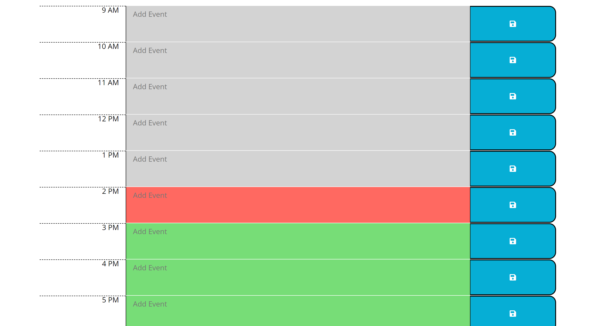

# Work Day Scheduler -OT

## Description 

### User Story

```
AS AN employee with a busy schedule
I WANT to add important events to a daily planner
SO THAT I can manage my time effectively
```

### Acceptance Criteria

```
* The current day is displayed at the top of the calender when a user opens the planner.
 
* Timeblocks for standard business hours are presented when the user scrolls down.
 
* The timeblocks are color-coded based on past, present, and future when viewed.
 
* The user can enter an event when they click a timeblock.

* The event is saved in local storage when the save button is clicked in that timeblock.

* The code retains events when the page is refreshed.
```

## Table of Contents

* [Description](#description)
* [Usage](#usage)
* [Credits](#credits)
* [License](#license)

## Usage 

### Deployed Application

* The URL of the deployed application:
[https://thorbieey.github.io/Day-Scheduler/](https://thorbieey.github.io/Day-Scheduler/)

* The URL of the GitHub repository: 
[https://github.com/Thorbieey/Day-Scheduler.git](https://github.com/Thorbieey/Day-Scheduler.git)

#### Screenshots/Demo




## Credits

* [Learn about moment.js](https://momentjs.com/docs/)

* [Learn about HTML Element: **textarea**](https://developer.mozilla.org/en-US/docs/Web/HTML/Element/textarea#styling_with_css)

* [Meet jQuery method: **each()**](https://api.jquery.com/jquery.each/)

* [Learn about addEventListener method](https://api.jquery.com/category/events/)

## License

Licensed under the [MIT](https://choosealicense.com/licenses/mit/) license